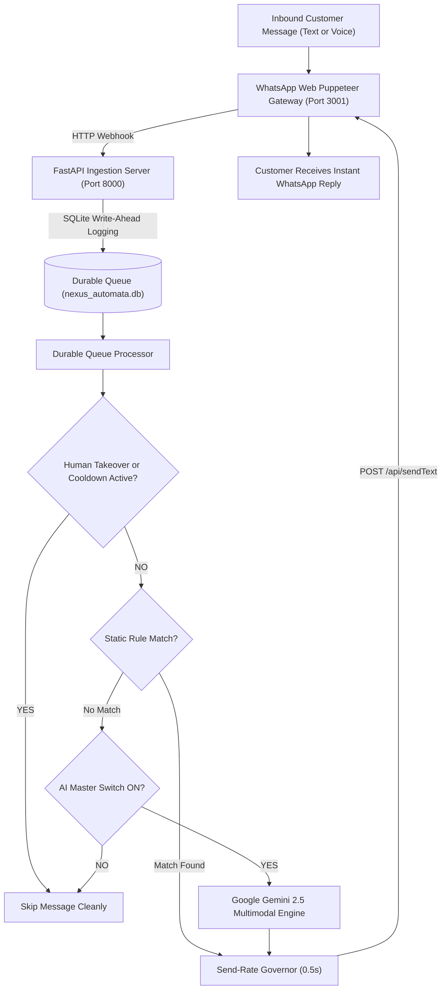

# CyberSolu Auto — Multi-Account WhatsApp Automation & AI CRM Suite

<p align="center">
  <b>Enterprise-Grade Multi-Account WhatsApp Business CRM, AI Voice Note Transcriber, Rule Studio, Catch-Up Studio, and Automated Contact Saver.</b>
</p>

<p align="center">
  <a href="https://www.python.org/"></a>
  <a href="https://nodejs.org/"></a>
  <a href="https://pypi.org/project/PyQt6/"></a>
  <a href="https://deepmind.google/technologies/gemini/"></a>
  <a href="https://www.sqlite.org/"></a>
  <a href="LICENSE"></a>
</p>

---

## 📌 What is CyberSolu Auto?

**CyberSolu Auto** is a standalone, local-first **WhatsApp Automation and Customer Support CRM** designed for e-commerce stores, digital agencies, and high-volume customer support operations. 

Built with **PyQt6 (Python)** on the front end and an embedded **Puppeteer / WhatsApp Web Engine** on the back end, it provides multi-account orchestration, zero-delay inbound lead capture, automated Roman Urdu & Urdu voice note comprehension, customer contact numbering, and dedicated unread message recovery.

---

## ⚡ Core Features & Capabilities

### 📱 1. Multi-Account WhatsApp Orchestration
* Run and monitor multiple WhatsApp numbers simultaneously in isolated browser sessions.
* Real-time connection status monitoring (`WORKING`, `SCAN_QR_CODE`, `STARTING`, `STOPPED`).
* Zero session loss with automated cryptographic token backups.

### 🎙️ 2. Multimodal AI Voice Note & Text Assistant (Gemini 2.5)
* Automatically downloads incoming WhatsApp voice notes (`.ogg` / `.opus`) and transcribes/understands Pakistani Urdu, Roman Urdu, and English accents.
* Multi-Tier AI fallback model hierarchy: **Gemini 2.5 Flash** $\rightarrow$ **Gemini 2.5 Flash Lite** $\rightarrow$ **Gemma 4** $\rightarrow$ **Failsafe Safe Mode**.
* Generates contextual, human-like replies answering product pricing, policies, and availability.

### 📥 3. Dedicated Catch-Up Studio (Unread Queue Manager)
* Extract and review unread customer messages accumulated during offline periods or overnight.
* Filter by connected account or time windows (6h, 12h, 24h, 48h, or No Limit).
* Complete exclusion of archived chats to protect historical order records.
* One-click bulk reply execution at safe, rapid 0.5s speed.

### 🏷️ 4. Automated Contact Saver & Sequential Order ID Numbering
* Reads customer chats from specific WhatsApp labels.
* Numbers contacts sequentially starting from custom order numbers (e.g. `#2250`, `#2251`).
* Updates the WhatsApp address book directly inside WhatsApp Web.

### 🛡️ 5. Anti-Ban Safety Governor & Human Takeover
* **Send-Rate Governor**: Configurable dispatch speed (0.5s default), randomized human jitter, and daily caps.
* **Human VA Manual Takeover Mode**: Pauses automated bot dispatches when a human representative types in the browser.
* **Per-Customer Cooldown**: Prevents repeat auto-reply spam within configurable time windows.

---

## 🏗️ Technical Architecture



---

## 🚀 Quick Start Guide

### Prerequisites
* **Python**: 3.10 or higher
* **Node.js**: 18.x or higher
* **OS**: Windows 10 / Windows 11 (or Linux/macOS)

### 1. Clone the Repository
```bash
git clone https://github.com/Daniyal-Rashid-00/whatsapp-automation-multi-account.git
cd whatsapp-automation-multi-account
```

### 2. Set Up Python Environment
```powershell
python -m venv venv
.\venv\Scripts\Activate.ps1
pip install -r requirements.txt
```

### 3. Launch CyberSolu Auto
```powershell
python main.py
```
The embedded gateway will start automatically, and the PyQt6 control console will launch on your screen.

---

## ⚙️ Configuration & Settings

| Parameter | Default | Description |
| :--- | :--- | :--- |
| `waha_url` | `http://localhost:3001` | WhatsApp Web Gateway endpoint |
| `send_min_delay_seconds` | `0.5` | Minimum human-like reply delay |
| `cooldown_minutes` | `10` | Time window to suppress duplicate auto-replies |
| `human_takeover_minutes` | `5` | Duration bot pauses after human VA manual reply |
| `ignore_groups` | `1` | Disables automated replies in group chats |

---

## 🔍 Frequently Asked Questions (FAQ)

### Can CyberSolu Auto understand Urdu Voice Notes?
Yes. Voice notes are downloaded in base64 format and passed to Gemini 2.5 Flash multimodal models for transcription and intent recognition, responding naturally in text.

### Are archived chats affected?
No. CyberSolu Auto strictly excludes archived chats from both live automation and Catch-Up Studio scans.

---

## 📄 License
Distributed under the MIT License. See `LICENSE` for more information.
