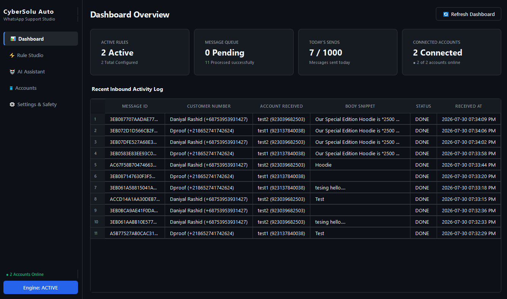
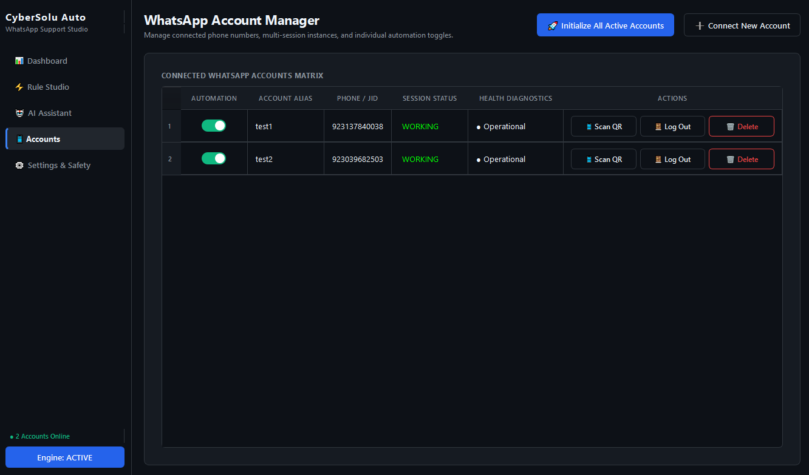
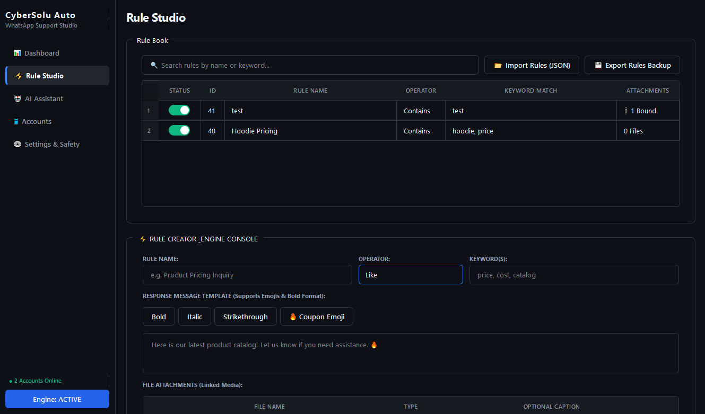
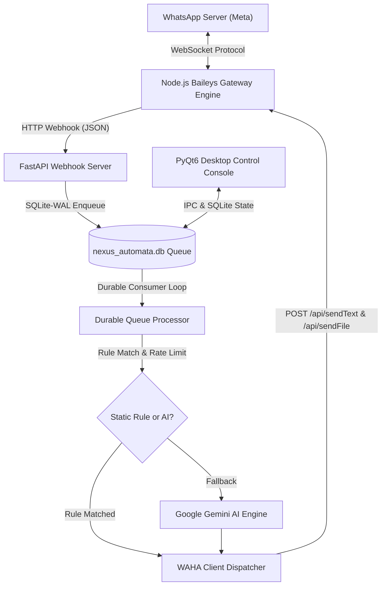

# CyberSolu Auto — Enterprise WhatsApp Automation & Support Studio

[](https://www.python.org/)
[](https://nodejs.org/)
[](https://github.com/WhiskeySockets/Baileys)
[](https://pypi.org/project/PyQt6/)
[](https://www.sqlite.org/)
[](LICENSE)

**CyberSolu Auto** is a production-grade, multi-account WhatsApp automation studio designed for e-commerce brands, customer support teams, and digital marketing agencies. Powered by a direct Baileys WebSocket protocol gateway and a PyQt6 desktop control console, CyberSolu Auto captures 100% of TikTok & Meta ad starter leads, routes multi-account incoming chats, and executes intelligent automated rule dispatches without DOM-scraping fragility.

---

## 📸 Screenshots & Interface Showcase

> **Note for Repository Maintainers:** To display your application screenshots on GitHub, save your exported PNG images into the `assets/screenshots/` directory using the filenames below.

<p align="center">
  
  <br/>
  <i>Figure 1: CyberSolu Auto Dashboard featuring real-time account status, queue metrics, and 12-hour AM/PM inbound activity logs.</i>
</p>

<br/>

<p align="center">
  
  
  <br/>
  <i>Figure 2: Multi-Account WhatsApp Matrix (Left) & Rule Studio with document attachment manager (Right).</i>
</p>

---

## ✨ Key Enterprise Features

* **📱 Native Multi-Account Gateway:** Connect and manage unlimited WhatsApp numbers (`Primary Account`, `Sales Line`, `Support Line 2`) in parallel. Each session operates in complete cryptographic isolation.
* **⚡ 100% Ad Lead Capture:** Connects directly via WebSocket protocol. Captures TikTok, Facebook, and Instagram click-to-WhatsApp pre-filled ad messages (including product links & catalog parameters) instantly.
* **🛡️ Send-Rate Governor (Anti-Ban Engine):** Configurable minimum delay (`send_min_delay_seconds`), randomized human jitter (`send_jitter_seconds`), and daily send limits (`send_daily_cap`) to safeguard account health.
* **📎 Automated Media & Document Dispatch:** Link PDFs, catalog images, videos, and price sheets to trigger keywords. Media is sent cleanly without extra text wrappers.
* **🤖 AI Fallback Integration:** Seamlessly delegates unmatched customer inquiries to Google Gemini AI with customized system prompts and brand context.
* **📦 Durable SQLite-WAL Queue:** High-concurrency Write-Ahead Logging database queue ensures zero message loss even during network disconnections or system reboots.
* **🚫 Group Filter Control:** Toggle individual or global filters to ignore group messages (`@g.us`) and automate 1-on-1 customer support chats exclusively.

---

## 🏗️ System Architecture



---

## 🚀 Quick Start & Installation

### Prerequisites
* **Python**: 3.10 or higher
* **Node.js**: 18.x or higher (with `npm`)
* **OS**: Windows 10/11, macOS, or Linux

### 1. Clone the Repository
```bash
git clone https://github.com/YOUR-USERNAME/CyberSolu-WhatsApp-Auto.git
cd CyberSolu-WhatsApp-Auto
```

### 2. Set Up Python Virtual Environment
```bash
# Windows (PowerShell)
python -m venv venv
.\venv\Scripts\Activate.ps1

# Linux / macOS
python3 -m venv venv
source venv/bin/activate
```

### 3. Install Dependencies
```bash
# Install Python packages
pip install -r requirements.txt

# Install Node.js Gateway dependencies
cd wa_engine
npm install
cd ..
```

### 4. Launch Application
```bash
python main.py
```

---

## 📁 Repository Structure

```text
CyberSolu-WhatsApp-Auto/
├── assets/
│   └── screenshots/         # Place your GitHub README screenshots here
├── wa_engine/
│   ├── server.js            # Node.js Baileys Multi-Account Gateway Server
│   ├── package.json         # Baileys & Express dependencies
│   └── sessions/            # Isolated E2EE session auth stores
├── ui/
│   ├── pages/               # PyQt6 Page Views (Dashboard, Accounts, Rules, Settings)
│   ├── widgets/             # Custom UI Widgets (Toggle Switches, Cards, Modals)
│   └── theme.py             # Enterprise Corporate Dark Theme QSS
├── database.py              # SQLite-WAL Schema & DAO
├── queue_processor.py       # Background Queue Consumer & Dispatcher
├── rate_governor.py         # Send-Rate Governor & Anti-Ban Delay Logic
├── webhook_server.py        # FastAPI Inbound Webhook Listener
├── waha_client.py           # Outbound HTTP Client
├── waha_launcher.py         # Subprocess Gateway Process Manager
├── main.py                  # Desktop Application Entry Point
├── README.md                # Project Documentation
└── requirements.txt         # Python Dependencies
```

---

## 🖼️ How to Add Screenshots to Your Repository

1. Create a folder named `assets/screenshots` in your project folder.
2. Save your application screenshots inside `assets/screenshots/` with these exact names:
   * `dashboard.png` (Main Dashboard view)
   * `accounts_matrix.png` (Accounts Management view)
   * `rule_studio.png` (Rule Creation & Media Attachment view)
   * `settings.png` (Settings & Safety view)
3. Push your repository to GitHub. The images will automatically display inside this `README.md`!

---

## 🛡️ Compliance & Safety Notice

WhatsApp enforces automated detection algorithms. To maintain long-term account health:
* Always use **customer-initiated messaging** (e.g. TikTok / Meta click-to-WhatsApp ads).
* Keep **Send-Rate Governor delay rules active** (`send_min_delay_seconds: 2.5s`, `send_jitter_seconds: 1.5s`).
* Gradually ramp message volume over 1–2 weeks for newly registered phone numbers.

---

## 📜 License

Distributed under the **MIT License**. See `LICENSE` for more information.
